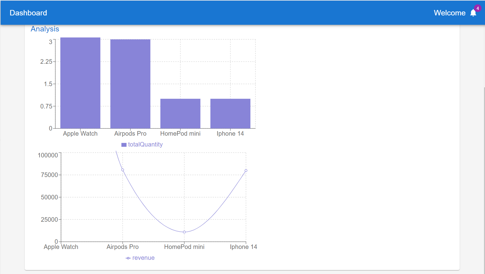

# Video link

https://drive.google.com/drive/folders/172DUvhQCgufcJh7oU7_m0de1vNvlAuNL?usp=share_link

# Features Implemented

1. Three stakeHolders: `buyer`(customer), `seller`, `advertiser`
2. Login page
3. Register seller
4. Register advertiser
5. Register buyer
6. After succesful login based on the stakeholder, the user is redirected to the respective page
7. Buyer can view the products and add them to the cart
8. Seller can add products to the database
9. product can be added to warehouse of choice
10. Advertiser can add advertisements
11. Buyer can view the advertisements
12. Seller can edit/delete the products
13. Seller have an inventory of different types of items of different quantities that change dynamically as purchase happens
14. Customer can search for the items
15. advertisements in the customer search interface for the items
16. customer add items to his/her cart
17. customer modifies his/her cart
18. review cart,checkout through Dummy interface to pay for items
19. payment through multiple cards
20. Exception handling when amount balance is less than the amount to be paid (minimum balance of 1000)
21. Platform enjoys 5% commision on each transactions
22. On succesful payment the sellers of the individual items in the order gets the amount credited to his/her account,also the inventory of the sellers is updated,customer cart is emptied
23. Discounted amount withdrawn from the bank of the advertiser and credited to the seller
24. order history
25. seller can view the orders
26. seller dashboard has analytics of revenue genrated on each product,quantity of each product sold.Charts are used to visually represent the data.
27. Balance can be viewed in the seller dashboard,advetiser dashboard.
28. Customer can return items.customer can even return individual items from the order
29. Seller can view the returns and approve or reject them
30. if seller accepts the return, the amount is refunded to the buyer and e-mail is sent to the buyer.Amount is also deducted from the seller's balance.Discounted amount if any gets refunded to advertiser
31. Buyer can track the order

# Images

## Login

 

## Signup

## Buyer

 

## Seller

 

## Advertiser

